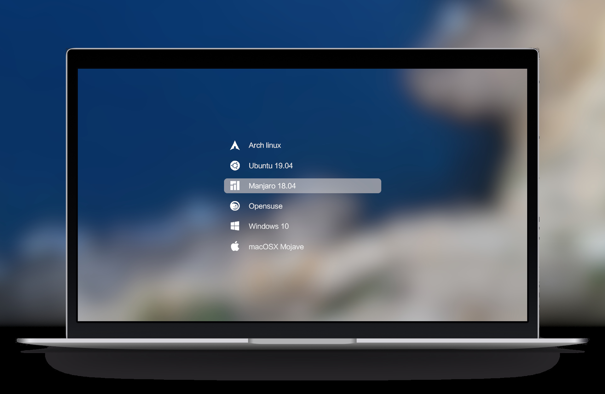

> Forked from [the awesome "Flat design themes" by vinceliuice](https://github.com/vinceliuice/grub2-themes).

## Kawaiki Design themes for Grub

## Installation:

Usage:  `sudo ./install.sh [OPTIONS...]`

|  Options:              | Description: |
|:-----------------------|:-------------|
| -b, --boot             | Install grub theme into `/boot/grub/themes` |
| -t, --theme            | theme variant(s) [kawaiki] (default is kawaiki)|
| -i, --icon             | icon variant(s) [color/white/whitesur] (default is white) |
| -s, --screen           | screen resolution variant(s) [1080p/2k/4k/ultrawide/ultrawide2k] (default is 1080p) |
| -r, --remove [THEME]   | Uninstall selected theme |
| -h, --help             | Show this help |

_If no options are used, a user interface `dialog` will show up instead_

### Examples:
 - Install Tela theme on 2k display device:
   - `sudo ./install.sh -t kawaiki -s 2k`

 - Install Tela theme into /boot/grub/themes:
   - `sudo ./install.sh -b -t kawaiki`

 - Uninstall Tela theme:
   - `sudo ./install.sh -r -t kawaiki`

## Issues / tweaks:

### Correcting display resolution:

 - On the grub screen, press `c` to enter the command line
 - Enter `vbeinfo` or `videoinfo` to check available resolutions
 - Open `/etc/default/grub`, and edit `GRUB_GFXMODE=[height]x[width]x32` to match your resolution
 - Finally, run `grub-mkconfig -o /boot/grub/grub.cfg` to update your grub config

### Setting a custom background:

 - Make sure you have `imagemagick` installed, or at least something that provides `convert`
 - Find the resolution of your display, and make sure your background matches the resolution
   - (1920x1080 -> --1080p, 2560x1080 -> --ultrawide, 2560x1440 -> --2k, 3440x1440 -> --ultrawide2k, 3840x2160 -> --4k)
 - Place your custom background inside the root of the project, and name it `background.jpg`
 - Run the installer like normal, but with -s `[YOUR_RESOLUTION]` and -t `[THEME]` and -i `[ICON]`
   - Make sure to replace `[YOUR_RESOLUTION]` with your resolution and `[THEME]` with the theme

## Contributing:
 - If you made changes to icons, or added a new one:
   - Delete the existing icon, if there is one
   - Run `cd assets; ./render-all.sh`
 - Create a pull request from your branch or fork
 - If any issues occur, report then to the [issue](https://github.com/vinceliuice/grub2-themes/issues) page

## Documents
http://wiki.rosalab.ru/en/index.php/Grub2_theme_/_reference
http://wiki.rosalab.ru/en/index.php/Grub2_theme_tutorial
